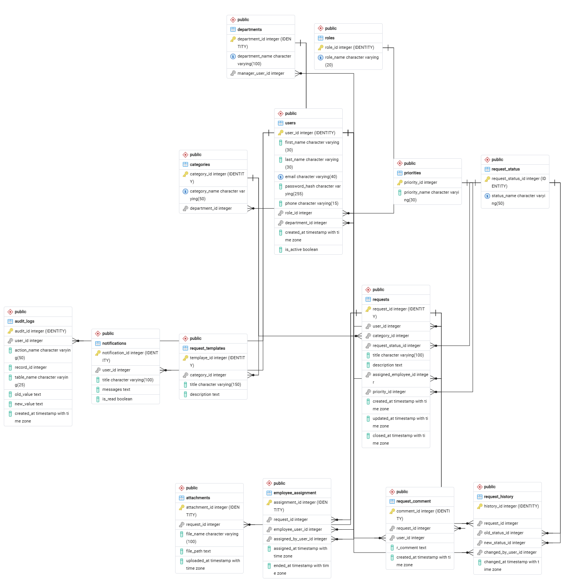
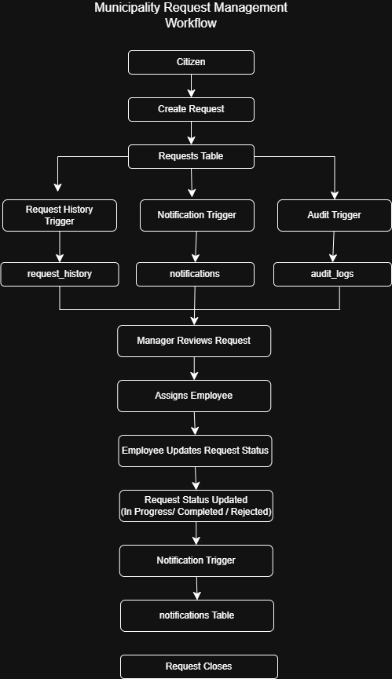
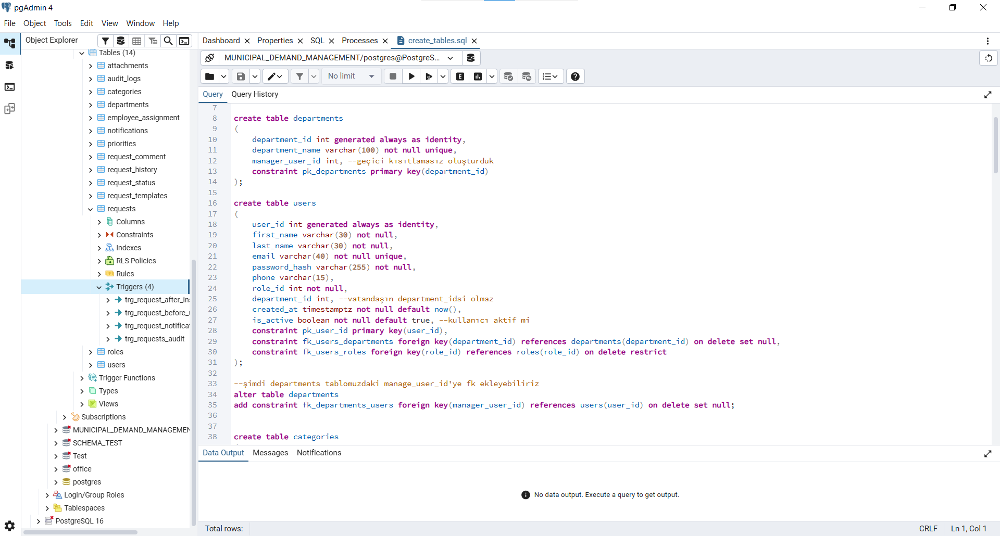
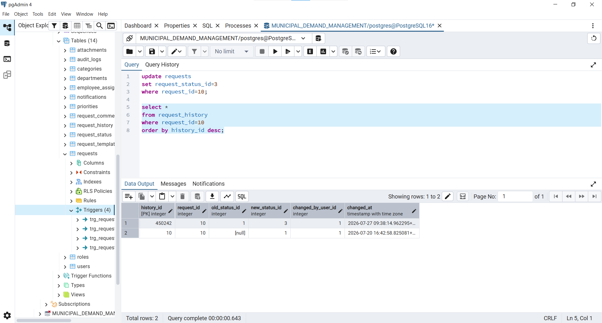
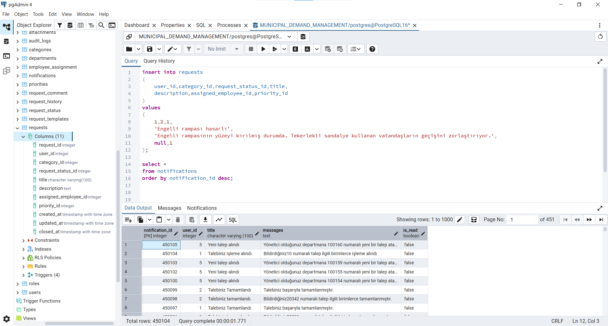
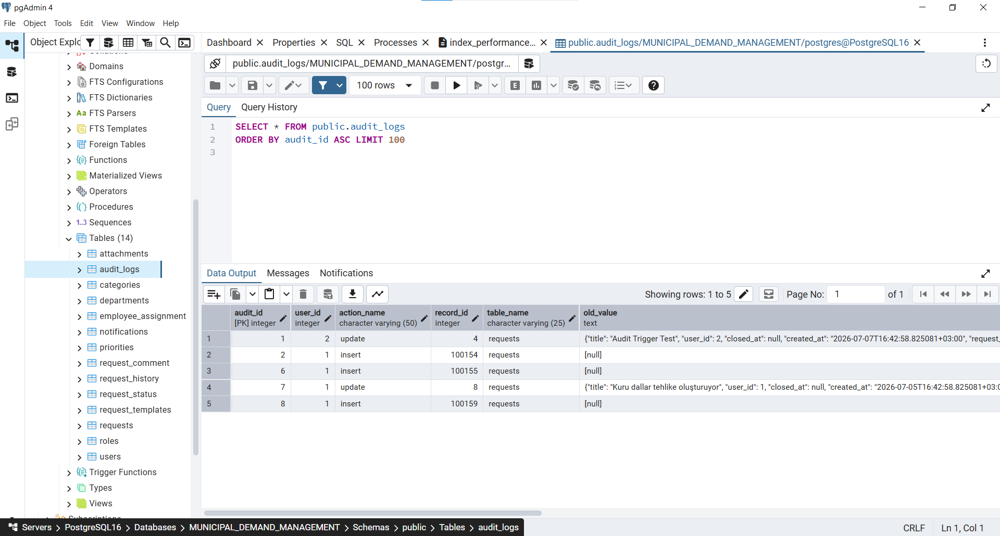
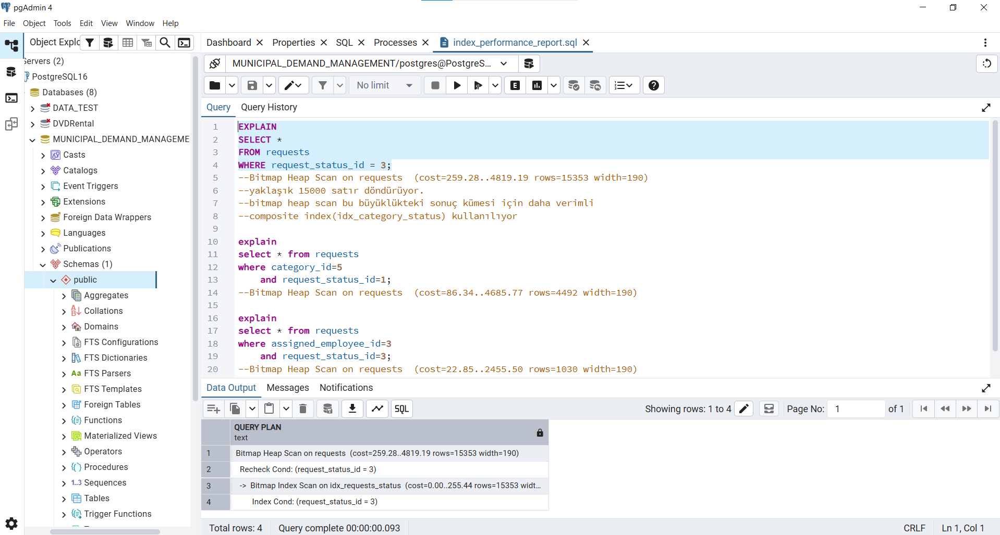
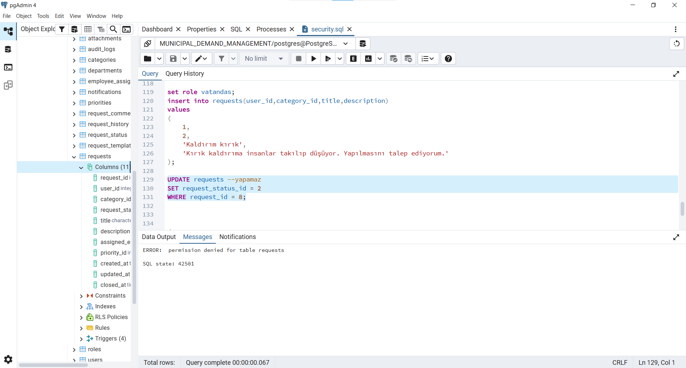

# Municipality Request Management System


A PostgreSQL-based Municipality Request Management System developed during my Database Internship.

---

# Project Overview

This project is a relational database system designed to manage municipality service requests submitted by citizens.
The system simulates a real municipality workflow where requests are created by citizens, assigned to employees, managed by department managers, and monitored by database administrators.
The project was developed using PostgreSQL and includes advanced database concepts such as triggers, transactions, indexing, RBAC security, backup & restore, monitoring, and performance optimization.

---

# Core Database Architecture & Applied Concepts

## 1. Database Design & Integrity
- Relational Modeling(3NF): Designed with full Third Normal Form compliance to eliminate data redundancy.
- Constraints: Applied Foreign Keys, Primary Keys, Unique, and Check constraints for data integrity.
- Views: Created modular SQL views for complex analytical and reporting queries.

## 2. Automation & Logic (PL/pgSQL)
- Triggers & Functions: Event-driven database automation for status tracking and logging.
- Notification Engine: Event-triggered automated notifications for citizens and employees.
- Audit Logging: System-wide automated `INSERT`, `UPDATE`, `DELETE` change-tracking.

## 3. Concurrency & Transaction Management
- ACID Compliance & Savepoints: Granular transaction management using `BEGIN`, `COMMIT`, `SAVEPOINT`, and `ROLLBACK`.
- Concurrenct & Lock Analysis: Explicit locking (`FOR UPDATE`, `FOR SHARE`) and deadlock scenario analysis.
- Isolation Levels: Evaluated behavior under `READ COMMITTED`, `REPEATABLE READ`, and `SERIALIZABLE`.

## 4. Security & Governance (RBAC)
- Role-Based Access Control: Granular permission management across 5 dedicated roles (`Citizen`, `Employee`, `Manager`, `ReadOnly`, `DBA`).
- Security Definer Functions: Controlled data access bypassing standard user table permissions where required.

## 5. Performance Optimization & Monitoring
- Indexing Strategies: Applied B-Tree Single-column, Composite and Partial Indexes based on `EXPLAIN ANALYZE` execution plans.
- Database Observability: System monitoring using `pg_stat_activity`, `pg_stat_user_indexes`, and cache hit ratio analysis.
- Disaster Recovery: Implemented database backup strategies (Full, Schema-only, Data-only) and restore routines.

---

# Technologies

- PostgreSQL
- PL/pgSQL
- pgAdmin 4
- SQL
- Git
- GitHub

---

# Entity Relationship Diagram

The following ER diagram represents the relational structure of the Municipality Request Management System database.



---

# Project Structure

```text
Municipality-Request-Management-System
├── Backup_Restore
│	├── municipality.backup
│	├── schema_only.backup
│	└── data_only.backup
├── sql
│	├── create_tables.sql
│	├── deadlock_deneme.sql
│	├── index_performance_report.sql
│	├── indexes.sql
│	├── monitoring.sql
│	├── monitoring_queries.sql
│	├── security.sql
│	├── seed_data.sql
│	├── seed_data_function.sql
│	├── transaction.sql
│	├── trigger.sql
│	└── views.sql
├── docs
│	├── ER_Diagram.png
│	└── Request_Workflow.png
├── screenshots
│	├── audit_logs.png
│	├── create_table.png
│	├── explain_analyze.png
│	├── notifications.png
│	├── security.png
│	└── trigger.png
└── README.md
```

---


# Request Workflow

The workflow below illustrates how a municipality request is processed, including automatic trigger-based operations such as history tracking, notifications, and audit logging.



---

# Security

Available roles:

- Citizen
- Employee
- Manager
- ReadOnly
- DBA

Permissions were managed using:

- CREATE ROLE
- GRANT
- REVOKE
- ALTER ROLE
- SECURITY DEFINER

---

# Trigger System

Implemented automatic database automation using PostgreSQL Triggers.

## Request History Trigger

Automatically records every request status change.

## Notification Trigger

Automatically sends notifications to:

- Managers
- Employees
- Citizens

depending on request status.

## Audit Log Trigger

Stores:

- INSERT
- UPDATE
- DELETE

operations into the audit_logs table.

---

# Performance Optimization

Implemented optimization techniques including:

- Single Column Indexes
- Composite Indexes
- Partial Indexes
- EXPLAIN
- EXPLAIN ANALYZE

---

# Backup & Restore

Implemented backup strategies using PostgreSQL tools.

- Full Backup
- Schema Backup
- Data Backup
- Restore Operations

---

# Monitoring

The project includes PostgreSQL monitoring queries for analyzing database health and performance.

Implemented monitoring queries include:

- Active Database Sessions (`pg_stat_activity`)
- Blocking Sessions Detection (`pg_blocking_pids`)
- Lock & Wait Analysis
- Database Statistics (`pg_stat_database`)
- Cache Hit Ratio Analysis
- Sequential Scan vs Index Scan Statistics
- Index Usage Statistics (`pg_stat_user_indexes`)
- Database Index Information (`pg_indexes`)
- Table Size Analysis (`pg_relation_size`)
- Total Relation Size Analysis (`pg_total_relation_size`)

---


# Project Screenshots
### 1. Database Schema & Tables
A portion of the PostgreSQL database schema showing the core tables used in the Municipality Request Management System.



### 2. Automated History Trigger (`request_history`)
Every request status change is automatically recorded in the `request_history` table.



### 3. Notification Trigger System (`notifications`)
Automatic notifications generated through PostgreSQL triggers.



### 4. Audit Logging (`audit_logs`)
All INSERT, UPDATE and DELETE operations are automatically logged into the `audit_logs` table.



### 5. Indexing Performance Analysis (`EXPLAIN ANALYZE`)
Execution plan generated using `EXPLAIN ANALYZE` after implementing indexes.



### 6. Role-Based Access Control (RBAC)
Permission checks prevent unauthorized users from performing restricted operations.



---

# Future Improvements

- REST API Integration
- Docker Support
- PostgreSQL Partitioning
- CI/CD Pipeline
- Web Application Integration

# Author

**Aleyna Karataş**

PostgreSQL | SQL | PL/pgSQL | Database Design

# License

This project was developed for educational and portfolio purposes.


